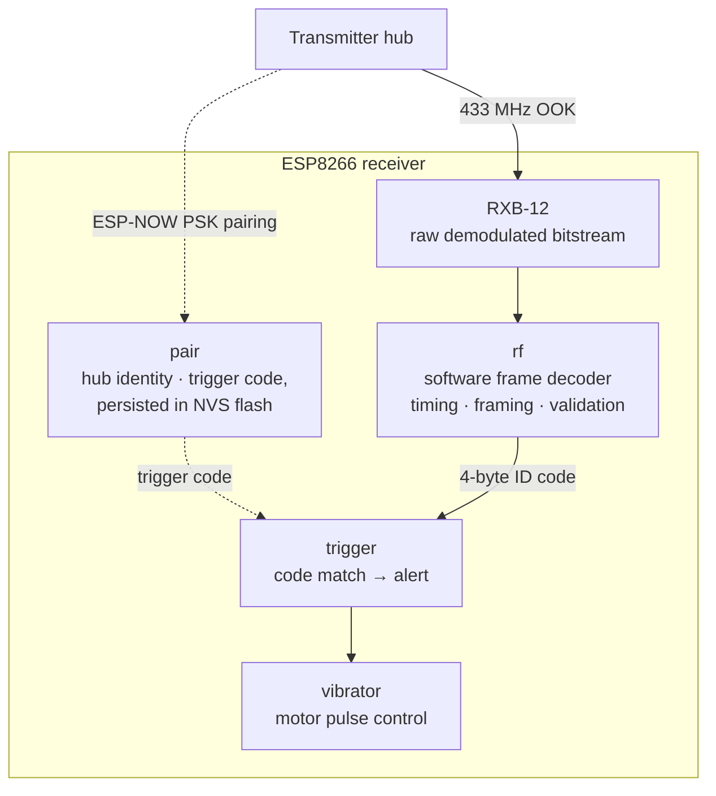

# NotiGuide — Receiver (ESP8266)

The 433 MHz variant of the NotiGuide pager. An RXB-12 superheterodyne module feeds this ESP8266 a raw OOK bitstream; the firmware decodes frames, matches them against its paired trigger code, and fires the vibration motor when a call comes in.

Its ESP32 sibling can run this same 433 MHz link or an nRF24 radio with hardware addressing; this build does the radio work in software on a much older MCU — which is exactly what makes it fun.

## Repository Branches

This repo hosts both pager variants, one per branch — they share a purpose but not an MCU or an SDK:

- [**`esp32`**](https://github.com/Thomas-Hoang-04/notiguide-receiver/tree/esp32) — ESP32-C3 on ESP-IDF v6.0, with a build-time radio choice: nRF24L01+ (2.4 GHz) or 433 MHz OOK.
- **`esp8266` (this branch)** — ESP8266 + RXB-12 on 433 MHz, built with the ESP8266 RTOS SDK.

## Techstack

<p>
  <a href="https://github.com/espressif/ESP8266_RTOS_SDK"></a>
  <a href="https://en.cppreference.com/w/c"></a>
  <a href="https://www.freertos.org/"></a>
</p>

## The NotiGuide System

NotiGuide is an end-to-end queue management and notification system for stores — customers join a virtual queue from their phone, staff run the floor from a dashboard, and calls reach people through web push or dedicated RF pagers. This repository is the pager.

| Repository | Role |
|------------|------|
| [notiguide](https://github.com/Thomas-Hoang-04/notiguide) | Workspace superproject — system docs and submodule index |
| [notiguide-be](https://github.com/Thomas-Hoang-04/notiguide-be) | Reactive Kotlin/Spring Boot API — queue engine, auth, analytics, device orchestration |
| [notiguide-admin](https://github.com/Thomas-Hoang-04/notiguide-admin) | Next.js dashboard for store staff — live queue control, dispatch, analytics |
| [notiguide-client](https://github.com/Thomas-Hoang-04/notiguide-client) | Next.js customer app — join queues, track position, receive web push |
| [notiguide-transmitter](https://github.com/Thomas-Hoang-04/notiguide-transmitter) | ESP32-C3 hub bridging MQTT dispatches to RF pager calls |
| [notiguide-receiver (`esp32`)](https://github.com/Thomas-Hoang-04/notiguide-receiver/tree/esp32) | ESP32-C3 pager — dual-radio (2.4 GHz nRF24 or 433 MHz OOK) |
| **notiguide-receiver (`esp8266`)** (this branch) | ESP8266 pager on the 433 MHz link |

## Features

- **433 MHz OOK decoding in software** — the RXB-12 hands over a raw demodulated stream; framing, trigger-code matching, and validation happen on the MCU.
- **Local pairing** — PSK challenge-response over ESP-NOW with a transmitter hub, persisted across reboots.
- **Vibration alerts** — a matched call triggers the vibration motor pulse.
- **Kconfig-driven setup** — pins and radio/pairing parameters configured via `make menuconfig`.

## Technical Highlights

- **Software radio on a constrained MCU** — OOK frame timing, decoding, and trigger-code matching done entirely in firmware, where the ESP32 sibling's 2.4 GHz build gets address filtering from silicon.
- **Pairing that survives power loss** — the paired hub identity and trigger code persist in NVS flash across reboots and battery swaps.
- **Small on purpose** — a handful of focused FreeRTOS tasks (radio, trigger, motor) with clear handoffs; the whole firmware is readable in one sitting.

## Architecture



## Hardware

| Part | Role |
|------|------|
| ESP-01 | ESP8266EX-based Wi-Fi module doing the software radio decoding |
| RXB-12 | 433 MHz superheterodyne receiver module |
| Vibration motor | The actual "you're up" signal |

GPIO assignments and radio parameters are configurable through `make menuconfig`.

> 📷 *Fully assembled ESP8266 receiver — coming soon*
<!-- PHOTO: assembled esp8266 pager build, RXB-12 module and vibration motor visible -->

## Getting Started

You need the [ESP8266 RTOS SDK](https://github.com/espressif/ESP8266_RTOS_SDK) (v3.x) with its toolchain on `PATH` and `IDF_PATH` pointing at the SDK.

```bash
make menuconfig          # Receiver Configuration → pins, radio, pairing
make all
make flash monitor
```

Pair the receiver with a transmitter hub (see the [transmitter repo](https://github.com/Thomas-Hoang-04/notiguide-transmitter)) and it's ready to be handed to a customer.

## Project Structure

```
main/
├── rf/           — 433 MHz OOK frame decoder
├── pair/         — PSK challenge-response pairing over ESP-NOW
├── provision/    — UART provisioning (designed, not yet implemented — see docs/UART Provisioning Design.md)
├── trigger/      — matches trigger codes and fires alerts
├── vibrator/     — motor pulse control
├── config/       — Kconfig glue and NVS-backed pairing persistence
└── main.c        — boot and task startup
```

---

_**Created by Minh Hai Hoang. June 2026**_
