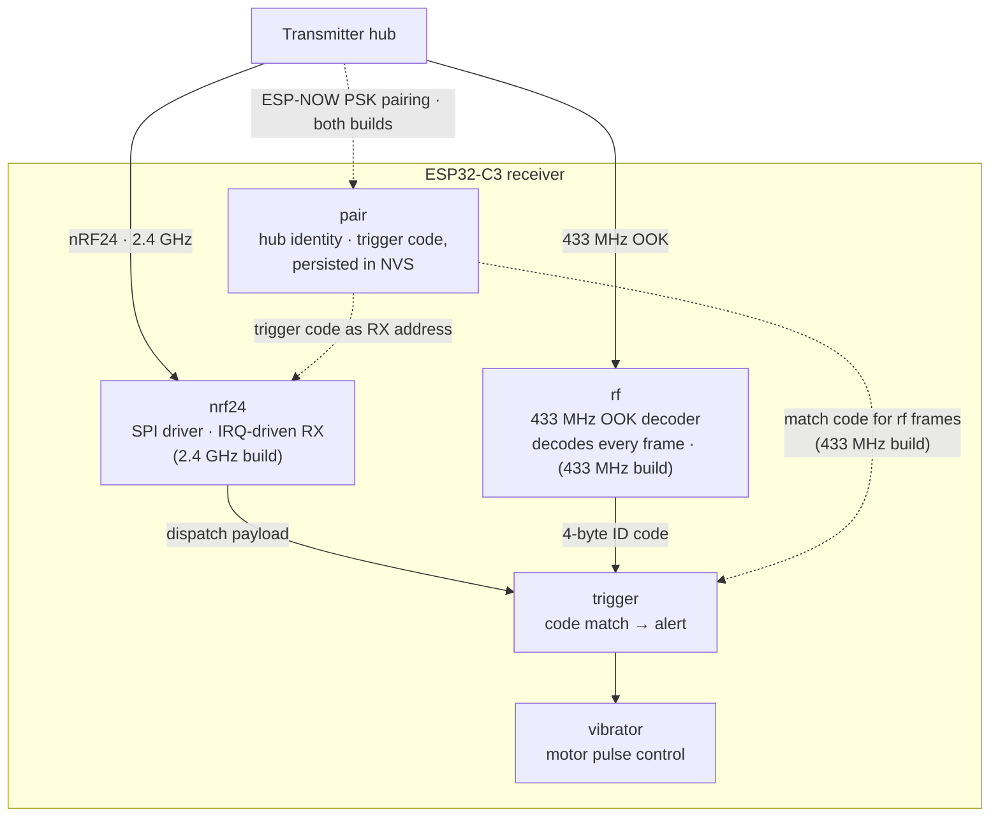

# NotiGuide — Receiver (ESP32-C3)

The pager itself. This ESP32-C3 firmware listens for calls addressed to it, and when one lands, the device buzzes — the customer holding it knows it's their turn, no phone required. It speaks either NotiGuide radio link — 2.4 GHz nRF24 or 433 MHz OOK — as a build-time choice; this tree ships with 2.4 GHz selected.

It pairs locally with a transmitter hub over a PSK challenge-response handshake, then spends its life in a receive loop: frame in, trigger-code match, vibration out.

## Repository Branches

This repo hosts both pager variants, one per branch — they share a purpose but not an MCU or an SDK:

- **`esp32` (this branch)** — ESP32-C3 on ESP-IDF v6.0, with a build-time radio choice: nRF24L01+ (2.4 GHz) or 433 MHz OOK.
- [**`esp8266`**](https://github.com/Thomas-Hoang-04/notiguide-receiver/tree/esp8266) — ESP8266 + RXB-12 on 433 MHz, built with the ESP8266 RTOS SDK.

## Techstack

<p>
  <a href="https://docs.espressif.com/projects/esp-idf/en/stable/esp32c3/"></a>
  <a href="https://en.cppreference.com/w/c"></a>
  <a href="https://www.freertos.org/"></a>
  <a href="https://cmake.org/"></a>
</p>

## The NotiGuide System

NotiGuide is an end-to-end queue management and notification system for stores — customers join a virtual queue from their phone, staff run the floor from a dashboard, and calls reach people through web push or dedicated RF pagers. This repository is the pager.

| Repository | Role |
|------------|------|
| [notiguide](https://github.com/Thomas-Hoang-04/notiguide) | Workspace superproject — system docs and submodule index |
| [notiguide-be](https://github.com/Thomas-Hoang-04/notiguide-be) | Reactive Kotlin/Spring Boot API — queue engine, auth, analytics, device orchestration |
| [notiguide-admin](https://github.com/Thomas-Hoang-04/notiguide-admin) | Next.js dashboard for store staff — live queue control, dispatch, analytics |
| [notiguide-client](https://github.com/Thomas-Hoang-04/notiguide-client) | Next.js customer app — join queues, track position, receive web push |
| [notiguide-transmitter](https://github.com/Thomas-Hoang-04/notiguide-transmitter) | ESP32-C3 hub bridging MQTT dispatches to RF pager calls |
| **notiguide-receiver (`esp32`)** (this branch) | ESP32-C3 pager — dual-radio (2.4 GHz nRF24 or 433 MHz OOK) |
| [notiguide-receiver (`esp8266`)](https://github.com/Thomas-Hoang-04/notiguide-receiver/tree/esp8266) | ESP8266 pager on the 433 MHz link |

## Features

- **Dual-radio receive loop** — nRF24L01+ (2.4 GHz) filtering frames by paired address in hardware, or 433 MHz OOK decoded in software; both are first-class `menuconfig` choices.
- **Local pairing** — PSK challenge-response over ESP-NOW with a transmitter hub; the device only answers its own hub afterwards.
- **Vibration alerts** — a paged call triggers the vibration motor pulse; no screen, no sound, no ambiguity.
- **Kconfig-driven setup** — pins, radio parameters, and pairing settings all live in `menuconfig`, alongside the radio selection.

## Technical Highlights

- **Hardware-filtered receive path** — in the 2.4 GHz build, the nRF24L01+ does address matching in silicon and raises an IRQ, so the RX task only runs for frames that are plausibly its own. The 433 MHz build does the same job in software, with a timing-based OOK decoder feeding the shared trigger matcher.
- **Pairing that survives power loss** — the paired hub address and trigger code persist in NVS flash; a pager handed out in the morning still knows its hub after a battery swap.
- **Small on purpose** — a handful of focused FreeRTOS tasks (radio, trigger, motor) with clear handoffs; the whole firmware is readable in one sitting.

## Architecture



## Hardware

| Part | Role |
|------|------|
| ESP32-C3 | Single-core RISC-V MCU running the receive loop |
| nRF24L01+ | 2.4 GHz radio listening to the hub (SPI) — 2.4 GHz build |
| 433 MHz OOK receiver | Demodulated-stream radio — 433 MHz build |
| Vibration motor | The actual "you're up" signal |

GPIO assignments and radio parameters are configurable through `idf.py menuconfig`; fit the radio matching the selected build.

> 📷 *Fully assembled ESP32-C3 receiver — coming soon*
<!-- PHOTO: assembled esp32 pager build, nRF24 module and vibration motor visible -->

## Getting Started

You need [ESP-IDF v6.0+](https://docs.espressif.com/projects/esp-idf/en/stable/esp32c3/get-started/index.html) with its environment exported.

```bash
idf.py set-target esp32c3
idf.py menuconfig        # Receiver Firmware → pins, radio, pairing
idf.py build
idf.py -p <PORT> flash monitor
```

Pair the receiver with a transmitter hub (see the [transmitter repo](https://github.com/Thomas-Hoang-04/notiguide-transmitter)) and it's ready to be handed to a customer.

## Project Structure

```
main/
├── nrf24/        — nRF24L01+ SPI driver (IRQ-driven RX task, 2.4 GHz build)
├── rf/           — 433 MHz OOK decoder (433 MHz build)
├── pair/         — ESP-NOW PSK challenge-response pairing
├── trigger/      — matches trigger codes and fires alerts
├── vibrator/     — motor pulse control
├── config/       — Kconfig glue and NVS-backed pairing persistence
└── main.c        — boot and task startup
```

---

_**Created by Minh Hai Hoang. June 2026**_
